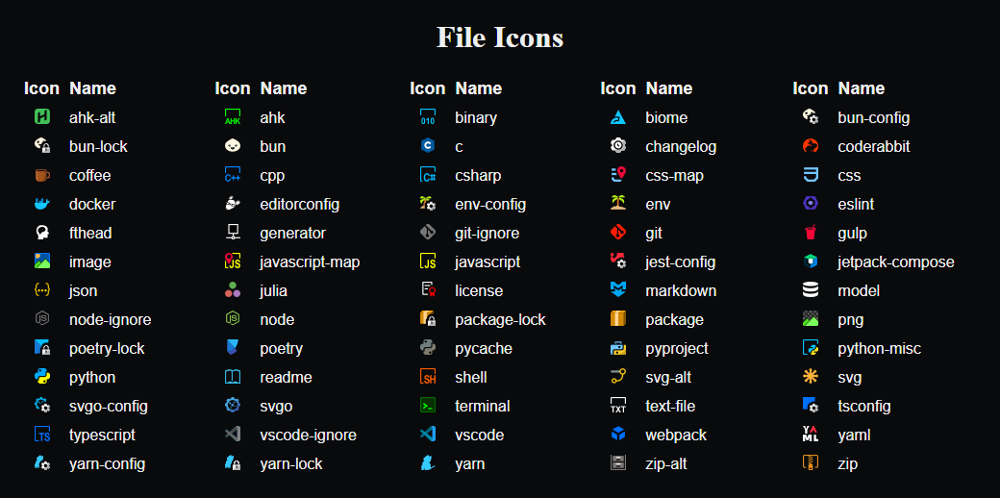

<!-- <h1 align="center">
   
    
    
  Material Icon Theme
   
   
</h1> -->

<h4 align="center">Get the Torn Focus UI enhancements into your VS Code.</h4>
<!--

    &nbsp;
    &nbsp;
    &nbsp;
    

 -->

&nbsp;

#### Change file & folder icon associations in real time

You can create or remove a custom icon assignment for a file or folder using the right click context menu in the explorer panel:

1. Right click the file or folder you wish to change the icon for:
2. Choose your icon from the list of available icons that is displayed in the command pallet:

